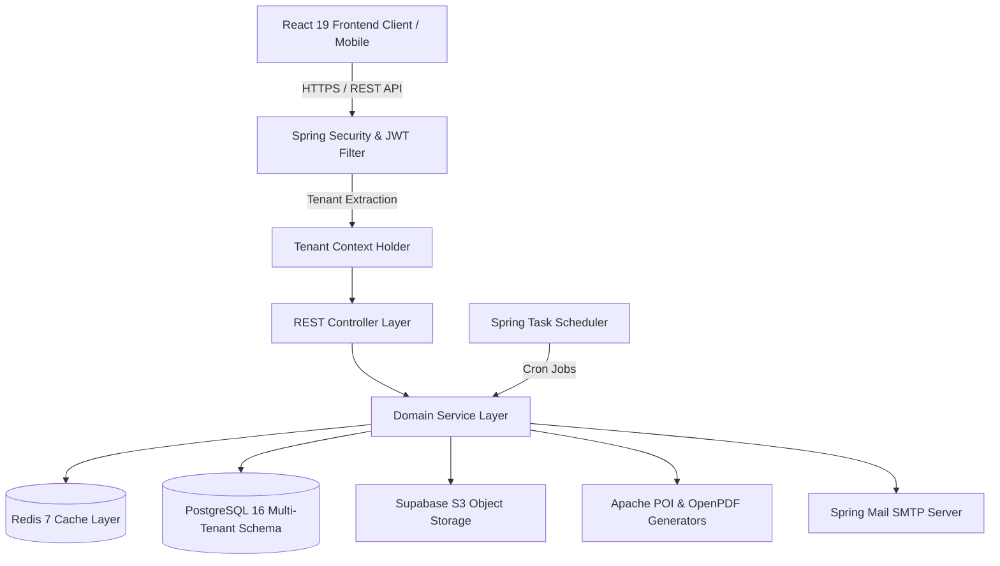
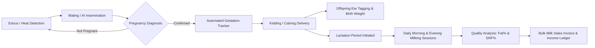
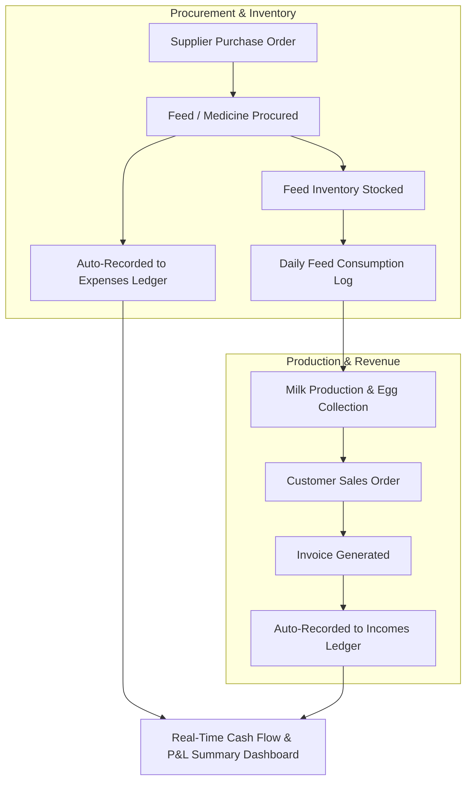

# 🌾 PP-Farms Backend — Multi-Tenant Livestock & Farm Management SaaS

[](https://www.oracle.com/java/)
[](https://spring.io/projects/spring-boot)
[](https://www.postgresql.org/)
[](https://redis.io/)
[](https://flywaydb.org/)
[](https://www.docker.com/)
[](http://localhost:8081/swagger-ui.html)
[]()

**PP-Farms Backend** is an enterprise-grade, high-concurrency, multi-tenant backend engine built with **Java 21** and **Spring Boot 3.3.4**. Designed for commercial livestock enterprises, goat/dairy farms, poultry operations, and multi-crop agriculture, the platform provides end-to-end herd lineage tracking, breeding and reproduction cycles, milk yield logging, feed rationing, automated vaccination alerts, double-entry financial accounting, CRM, and SaaS subscription billing.

---

## 📑 Table of Contents

- [Architectural Overview](#-architectural-overview)
- [Core Features & Domain Modules](#-core-features--domain-modules)
- [Tech Stack & Dependencies](#-tech-stack--dependencies)
- [System Architecture & Multi-Tenancy](#-system-architecture--multi-tenancy)
- [Database & Migrations](#-database--migrations)
- [Security & Authentication](#-security--authentication)
- [API Reference & Documentation](#-api-reference--documentation)
- [Environment Configuration](#-environment-configuration)
- [Getting Started](#-getting-started)
  - [Prerequisites](#prerequisites)
  - [Docker Quickstart (Recommended)](#docker-quickstart-recommended)
  - [Manual Local Setup](#manual-local-setup)
- [Background Jobs & Automation](#-background-jobs--automation)
- [Reporting & Storage Integrations](#-reporting--storage-integrations)
- [Testing & Quality Assurance](#-testing--quality-assurance)
- [Production Deployment](#-production-deployment)
- [License & Author](#-license--author)

---

## 🏛 Architectural Overview

### 1. System Topology & Request Pipeline


---

### 2. Complete Database Entity-Relationship Diagram (100% Schema ERD)

```mermaid
erDiagram
    ORGANIZATIONS ||--o{ USERS : employs
    ORGANIZATIONS ||--o{ ROLES : defines
    ORGANIZATIONS ||--o{ SUBSCRIPTIONS : holds
    PLANS ||--o{ SUBSCRIPTIONS : defines
    SUBSCRIPTIONS ||--o{ PAYMENTS : bills
    ORGANIZATIONS ||--o{ SHEDS_PENS : operates
    ORGANIZATIONS ||--o{ ANIMALS : owns
    SPECIES ||--o{ BREEDS : categorizes
    BREEDS ||--o{ ANIMALS : classifies
    SHEDS_PENS ||--o{ ANIMALS : houses
    ANIMALS ||--o{ ANIMALS : "sire/dam lineage"
    
    ANIMALS ||--o{ WEIGHT_RECORDS : tracks
    ANIMALS ||--o{ PRODUCTION_RECORDS : yields
    ANIMALS ||--o{ HEALTH_RECORDS : receives
    ANIMALS ||--o{ VACCINATION_RECORDS : inoculated
    ANIMALS ||--o{ DEWORMING_RECORDS : treated
    ANIMALS ||--o{ MORTALITY_RECORDS : records
    ANIMALS ||--o{ HEAT_CYCLES : observes
    ANIMALS ||--o{ BREEDING_RECORDS : bred
    BREEDING_RECORDS ||--o{ PREGNANCIES : conceives
    PREGNANCIES ||--o{ BIRTH_RECORDS : delivers
    BIRTH_RECORDS ||--o{ BIRTH_OFFSPRING : produces
    ANIMALS ||--o{ BIRTH_OFFSPRING : registers
    
    ORGANIZATIONS ||--o{ FLOCK_BATCHES : manages
    FLOCK_BATCHES ||--o{ FLOCK_MORTALITY_LOGS : logs
    FLOCK_BATCHES ||--o{ EGG_PRODUCTION_LOGS : collects
    
    ORGANIZATIONS ||--o{ FEED_INVENTORY : stocks
    FEED_INVENTORY ||--o{ FEED_CONSUMPTION_LOGS : consumes
    SHEDS_PENS ||--o{ FEED_CONSUMPTION_LOGS : fed_at
    
    ORGANIZATIONS ||--o{ CROP_PLOTS : cultivates
    CROP_PLOTS ||--o{ CROP_HARVEST_LOGS : harvests
    
    ORGANIZATIONS ||--o{ CUSTOMERS : engages
    ORGANIZATIONS ||--o{ SUPPLIERS : procures_from
    ORGANIZATIONS ||--o{ SALES : executes
    SALES ||--o{ SALE_ITEMS : contains
    CUSTOMERS ||--o{ SALES : buys
    
    ORGANIZATIONS ||--o{ PURCHASES : orders
    PURCHASES ||--o{ PURCHASE_ITEMS : contains
    SUPPLIERS ||--o{ PURCHASES : supplies
    
    ORGANIZATIONS ||--o{ INCOMES : earns
    ORGANIZATIONS ||--o{ EXPENSES : incurs
    ORGANIZATIONS ||--o{ TASKS : assigns
    USERS ||--o{ TASKS : executes
    ORGANIZATIONS ||--o{ AUDIT_LOGS : audits
    ORGANIZATIONS ||--o{ DOCUMENT_ATTACHMENTS : stores
```


---

### 3. Comprehensive Domain Flowcharts

#### A. Multi-Tenant Request Isolation & Security Pipeline (With Redis Rate Limiting)
```mermaid
flowchart TD
    Req[Incoming HTTP Request] --> RateLimiter{Redis @RateLimit Check}
    RateLimiter -- Limit Exceeded --> HTTP429[HTTP 429 Too Many Requests]
    RateLimiter -- Allowed --> JWTFilter[JwtAuthenticationFilter]
    JWTFilter --> AuthCheck{Valid JWT Bearer / Cookie?}
    AuthCheck -- No --> Deny[HTTP 401 Unauthorized]
    AuthCheck -- Yes --> Extract[Extract Tenant Org ID & User Role]
    Extract --> TenantCtx[Set TenantContext ThreadLocal]
    TenantCtx --> SecCtx[Set SecurityContextHolder]
    SecCtx --> Dispatcher[Spring MVC Controller Dispatcher]
    Dispatcher --> RBACCheck{@PreAuthorize Role Allowed?}
    RBACCheck -- No --> Forbidden[HTTP 403 Access Denied]
    RBACCheck -- Yes --> Svc[Domain Service Scoped to Org ID]
    Svc --> Repos[(PostgreSQL Queries with WHERE organization_id = ?)]
    Repos --> Cleanup[Clear TenantContext on Request Completion]
```

#### B. Livestock Breeding, Gestation & Dairy Production Lifecycle


#### C. End-to-End Farm ERP & Cash Flow Pipeline


- **Runtime:** Java 21 LTS with Virtual Threads (`spring.threads.virtual.enabled=true`) for non-blocking I/O.
- **Multi-Tenancy:** Schema-level data segregation with `organization_id` tenancy filters and role-based access control.
- **Persistence:** Hibernate 6 / Spring Data JPA paired with Flyway versioned migrations.
- **Caching:** Redis 7 with Cacheable abstractions for metadata, reference taxonomies, and analytics aggregation.
- **Storage:** Cloud-based Supabase S3 bucket integration for animal photos, invoices, and health records.

---

## 🚀 Core Features & Domain Modules

### 1. 🐐 Livestock & Herd Management (`/api/v1/animals`, `/api/v1/sheds`)
- Comprehensive animal profile with ear tag identification, RFID/tag tracking, species, breed, sex, birth date, and stage (Kid, Buck, Doe, Heifer, Bull, etc.).
- Lineage tree tracing (`sire_id` / `dam_id`) with automated pedigree mapping.
- Weight tracking history with average daily gain (ADG) calculations.
- Facility & shed assignment with capacity monitoring and quarantine tracking.

### 2. 🧬 Reproduction & Breeding Cycles (`/api/v1/breeding`, `/api/v1/births`)
- Heat detection and mating records (Natural Service & Artificial Insemination).
- Gestation calculator with automated delivery date predictions.
- Kidding / Calving / Lambing logs with litter size, kid tags, birth weights, and mortality recording.

### 3. 🥛 Production & Milk Yield Tracking (`/api/v1/production`)
- Daily session logging (Morning, Afternoon, Evening) per individual animal or bulk herd.
- Milk quality parameters (Fat %, SNF, Protein, Density).
- Aggregated yield statistics and lactation curves.

### 4. 💉 Health & Preventive Medicine (`/api/v1/health`, `/api/v1/vaccinations`)
- Clinical examination records, diagnostics, treatments, and prescriptions.
- Vaccination schedule management with batch inoculation logs.
- Automated withdrawal period monitoring for milk/meat safety compliance.

### 5. 🌾 Feed Inventory & Rationing (`/api/v1/feed`)
- Feed formula creation, ingredients catalog, and nutritional breakdown.
- Stock ledger (purchases, daily consumption, balance) with automated low-stock warnings.

### 6. 🐔 Poultry & Flock Management (`/api/v1/flocks`)
- Batch-based flock tracking (Broiler, Layer, Breeder).
- Daily egg collection logs, mortality tracking, feed conversion ratio (FCR).

### 7. 💰 Financial Accounting & Sales (`/api/v1/accounting`, `/api/v1/sales`, `/api/v1/purchases`)
- Complete income & expense categorization (Feed, Labor, Veterinary, Utilities, Sales).
- Livestock, milk, crop, and produce sales management with customer invoicing.
- Supplier purchase order tracking and payment statuses.

### 8. 📊 Advanced Analytics & Reporting (`/api/v1/analytics`, `/api/v1/reports`)
- Executive dashboard KPIs: Herd count, lactation status, monthly cash flow, mortality rates.
- On-demand PDF and Excel exports for herd records, milk sheets, veterinary logs, and P&L statements using **Apache POI** and **OpenPDF**.

### 9. 🏢 Multi-Tenant SaaS & Super Admin Console (`/api/v1/super-admin/*`)
- Multi-tier SaaS subscription plans (Starter, Pro, Enterprise) with animal and seat limits.
- Tenant provisioning, subscription approval, payment proof verification, and platform metrics (MRR, active tenants).

---

## 🛠 Tech Stack & Dependencies

| Category | Technology | Version | Purpose |
| :--- | :--- | :--- | :--- |
| **Language** | Java | 21 (LTS) | Core programming language with Virtual Threads |
| **Framework** | Spring Boot | 3.3.4 | Core enterprise application framework |
| **Security** | Spring Security + JJWT | 0.12.6 | Stateless JWT auth, RBAC, HttpOnly cookies |
| **Database** | PostgreSQL | 16 | Relational database with multi-tenant schema |
| **ORM** | Spring Data JPA / Hibernate | 6.x | Entity mapping and repository queries |
| **Migrations**| Flyway | Latest | Version-controlled schema evolutions |
| **Caching** | Spring Data Redis | 7-alpine | In-memory caching and session synchronization |
| **Documentation** | SpringDoc OpenAPI | 2.6.0 | Swagger UI and OpenAPI 3 schema generation |
| **Code Generation** | MapStruct + Lombok | 1.5.5 / 1.18.34 | Zero-boilerplate DTO mapping and models |
| **Reporting** | Apache POI & OpenPDF | 5.3.0 / 1.3.40 | Native Excel spreadsheet and PDF report generation |
| **Containerization** | Docker & Compose | Latest | Standardized container builds and orchestration |

---

## 🔒 Security & Multi-Tenancy

```
HTTP Request ──► [ JwtAuthenticationFilter ]
                     ├── Validate Access Token / Verify Signature
                     ├── Extract User ID, Role, and Organization ID
                     └── Populate TenantContext & SecurityContextHolder
                          └── Dispatches to @PreAuthorize Protected Controllers
```

- **Role-Based Access Control (RBAC):**
  - `SUPER_ADMIN`: Global platform console, tenant management, subscription approvals, audit logs.
  - `ADMIN` (Farm Owner): Full control of farm operations, financial records, staff users, and billing.
  - `MANAGER`: Daily operations, herd records, feed, sales, and task allocations.
  - `VET`: Medical diagnoses, health logs, vaccinations, and reproduction workflows.
  - `WORKER`: Daily milk entries, feeding logs, and assigned task updates.
- **Tenant Isolation:** Every operational entity extends `BaseEntity` with an `organization_id` foreign key. Repository queries and service methods enforce organization scoping to prevent cross-tenant leakage.

---

## 📡 API Reference & Documentation

When running locally, explore and test the entire interactive Swagger UI at:
👉 **`http://localhost:8081/swagger-ui.html`**

OpenAPI JSON specification:
👉 **`http://localhost:8081/v3/api-docs`**

### Summary of Key Endpoint Groups

| Base Path | Scope | Description |
| :--- | :--- | :--- |
| `/api/v1/auth` | Public / Auth | User registration, login, refresh token, password recovery |
| `/api/v1/organizations/me` | Farm Admin | Current farm organization details & profile updates |
| `/api/v1/users` | Farm Admin | Farm staff user management & role assignments |
| `/api/v1/animals` | Farm Staff | Livestock registry, pedigrees, weights, lifecycle stages |
| `/api/v1/sheds` | Farm Staff | Barns and housing facility management |
| `/api/v1/breeding` | Farm Staff / Vet | Insemination, mating, heat cycles, pregnancy checks |
| `/api/v1/births` | Farm Staff / Vet | Offspring birth records and newborn animal onboarding |
| `/api/v1/production` | Farm Staff | Daily milk collection entries and production charts |
| `/api/v1/health` | Farm Vet / Admin | Clinical treatments, medical history, diagnoses |
| `/api/v1/vaccinations`| Farm Vet / Admin | Inoculation schedules and booster tracking |
| `/api/v1/feed` | Farm Staff | Feed formulations, inventory logs, consumption |
| `/api/v1/flocks` | Farm Staff | Poultry flock batches, egg logs, mortality records |
| `/api/v1/crops` | Farm Staff | Field crop cycles, planting, harvests, and yields |
| `/api/v1/accounting` | Farm Admin | Double-entry income, expense, and cash flow ledger |
| `/api/v1/sales` | Farm Admin | Sales orders, customer invoices, revenue tracking |
| `/api/v1/purchases` | Farm Admin | Supplier orders, livestock purchases, inventory procurement |
| `/api/v1/customers` | Farm Staff | Customer directory and sales history |
| `/api/v1/suppliers` | Farm Staff | Feed/medicine vendor registry |
| `/api/v1/tasks` | Farm Staff | Operational task dispatching, due dates, statuses |
| `/api/v1/reports` | Farm Staff | Excel (`.xlsx`) and PDF report exports |
| `/api/v1/storage` | Farm Staff | Supabase bucket asset uploads (animal photos, receipts) |
| `/api/v1/analytics` | Farm Staff | Farm-level operational and financial KPIs |
| `/api/v1/super-admin/*`| Super Admin | Multi-tenant governance, payment verification, SaaS metrics |

A comprehensive **Postman Collection** is included at [`PP_Farms_Postman_Collection.json`](./PP_Farms_Postman_Collection.json).

---

## ⚙️ Environment Configuration

Create a `.env` file in the root of the backend directory by copying `.env.example`:

```bash
cp .env.example .env
```

| Key | Default Value | Description |
| :--- | :--- | :--- |
| `SERVER_PORT` | `8081` | Spring Boot HTTP server port |
| `SPRING_PROFILES_ACTIVE` | `dev` | Active Spring profile (`dev`, `prod`, `test`) |
| `DB_HOST` | `localhost` | PostgreSQL host (`postgres` inside Docker) |
| `DB_PORT` | `5433` | PostgreSQL port (docker-compose maps 5433 -> 5432) |
| `DB_NAME` | `farms_db` | PostgreSQL database name |
| `DB_USERNAME` | `postgres` | Database username |
| `DB_PASSWORD` | `postgres` | Database password |
| `DB_POOL_MAX_SIZE` | `20` | HikariCP maximum connection pool size |
| `DB_POOL_MIN_IDLE` | `5` | HikariCP minimum idle connections |
| `REDIS_HOST` | `localhost` | Redis server host (`redis` inside Docker) |
| `REDIS_PORT` | `6379` | Redis server port |
| `REDIS_PASSWORD` | *(empty)* | Redis password (if configured) |
| `JWT_SECRET` | *(64-byte secret)* | HMAC-SHA256 signing secret key |
| `JWT_ACCESS_TOKEN_EXPIRATION_MS` | `86400000` (24h) | Access token time-to-live |
| `JWT_REFRESH_TOKEN_EXPIRATION_MS`| `604800000` (7d) | Refresh token time-to-live |
| `SUPER_ADMIN_EMAIL` | `superadmin@ppfarms.com` | Initial super admin seed account |
| `SUPER_ADMIN_PASSWORD` | `SuperAdmin123!` | Initial super admin password |
| `SUPABASE_URL` | *(Supabase URL)* | Supabase project URL for cloud storage |
| `SUPABASE_KEY` | *(Service Key)* | Supabase service API key |
| `SUPABASE_BUCKET_ANIMALS` | `farm-animals` | Bucket for livestock pictures |
| `SUPABASE_BUCKET_RECEIPTS` | `payment-proofs` | Bucket for payment proof slips |
| `SUPABASE_BUCKET_REPORTS` | `farm-reports` | Bucket for generated report archives |
| `MAIL_HOST` | `smtp.gmail.com` | SMTP email server host |
| `MAIL_PORT` | `587` | SMTP port (TLS) |
| `MAIL_USERNAME` | *(Optional)* | SMTP sender email address |
| `MAIL_PASSWORD` | *(Optional)* | SMTP app password |

---

## 🚀 Getting Started

### Prerequisites
- **Java Development Kit (JDK):** Version 21 (Temurin / Oracle OpenJDK recommended)
- **Maven:** 3.9+ (or use the included `./mvnw` wrapper)
- **Docker & Docker Compose:** Latest version
- **PostgreSQL 16** & **Redis 7** (if running without Docker)

---

### Option A: Docker Compose Quickstart (Recommended)

1. Clone repository and navigate to backend directory:
   ```bash
   cd PP-Farms-Backend
   ```
2. Copy and configure the environment variables:
   ```bash
   cp .env.example .env
   ```
3. Start the entire backend ecosystem (PostgreSQL, Redis, and Spring Boot app):
   ```bash
   docker-compose up -d --build
   ```
4. Verify running containers:
   ```bash
   docker-compose ps
   ```
5. Check backend logs:
   ```bash
   docker-compose logs -f app
   ```

---

### Option B: Manual Local Setup

1. **Start Infrastructure Services:**
   Ensure PostgreSQL (port 5433 or 5432 as configured in `.env`) and Redis (port 6379) are active. You can run just the dependencies via Docker:
   ```bash
   docker-compose up -d postgres redis
   ```

2. **Build and Run the Spring Boot Application:**
   ```bash
   # On Linux/macOS
   ./mvnw clean spring-boot:run

   # On Windows PowerShell / CMD
   .\mvnw.cmd clean spring-boot:run
   ```

3. **Verify Health:**
   Open your browser to Swagger UI: `http://localhost:8081/swagger-ui.html`

---

## 🗄 Database & Migrations

Database migrations are managed through **Flyway**, ensuring idempotent and seamless deployments:

- `V1__initial_schema.sql`: Core tables, schemas, organizations, users, roles, animals, sheds, breeding, production, health, and accounting.
- `V2__complete_enterprise_modules.sql`: Feed formulas, flock management, crops, tasks, CRM suppliers, and document attachments.
- `V3__complete_enterprise_audit_columns.sql`: Enterprise audit timestamp columns (`created_by`, `updated_by`, `deleted_at`).
- `V4__standard_saas_plans.sql`: Default subscription plans (Starter, Pro, Enterprise), payment methods, and seed metadata.

To perform manual Flyway migration checks:
```bash
./mvnw flyway:info
```

---

## 🧪 Testing & Quality Assurance

Run the comprehensive unit, integration, and security test suite:

```bash
# Run all tests
./mvnw clean test

# Run tests with detailed log output
./mvnw test -Dtest=*Test -Dspring.profiles.active=test
```

---

## 📦 Production Deployment

To package the application into a high-performance, containerized executable JAR:

```bash
./mvnw clean package -DskipTests
```

The optimized JAR will be generated at `target/PP-Farms-Backend-0.0.1-SNAPSHOT.jar`.

### Production Docker Container:
```dockerfile
# Multi-stage production build
FROM eclipse-temurin:21-jre-alpine
WORKDIR /app
COPY target/PP-Farms-Backend-0.0.1-SNAPSHOT.jar app.jar
EXPOSE 8080
ENTRYPOINT ["java", "-XX:+UseZGC", "-XX:+ZGenerational", "-jar", "app.jar"]
```

---

## 👥 Author & Contributions

- **Developer:** Pamir Nayak ([GitHub Profile](https://github.com/PamirNayak))
- **Project:** PP-Farms Multi-Tenant Farm SaaS System
- **Contact:** `pamirnayak6@gmail.com`

---
*Built with passion for modern agricultural technology and sustainable farming.* 🚜🌱
